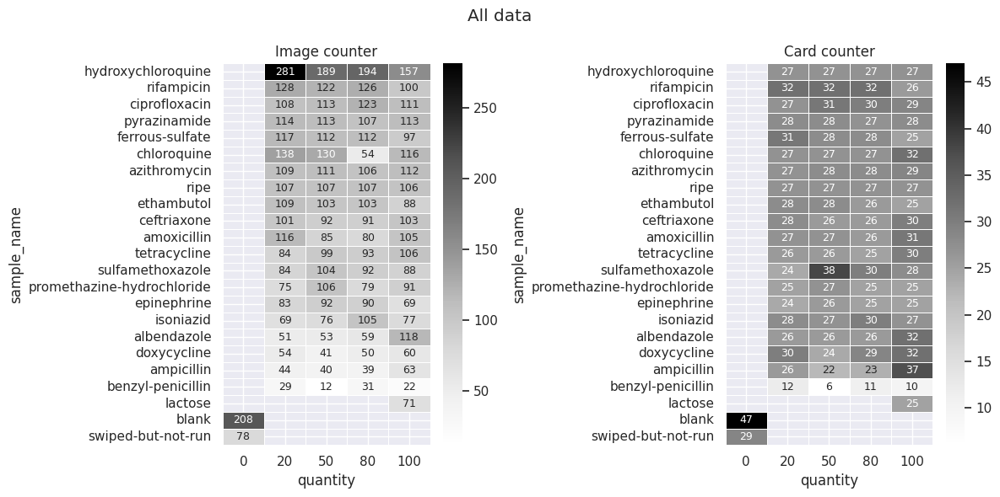
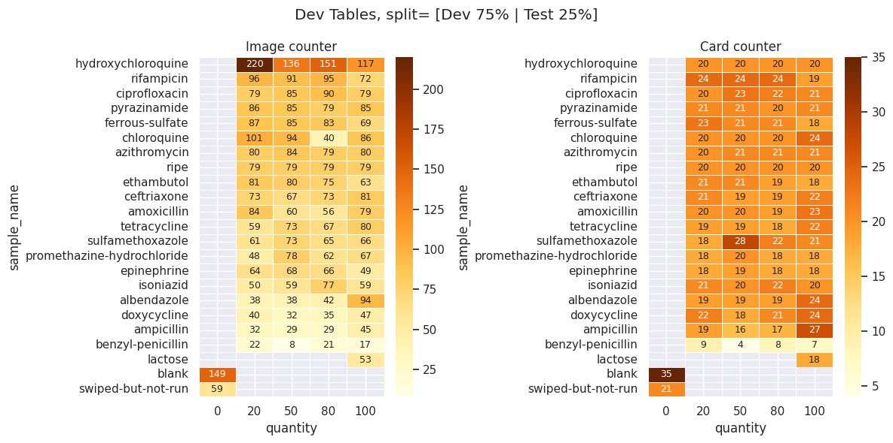
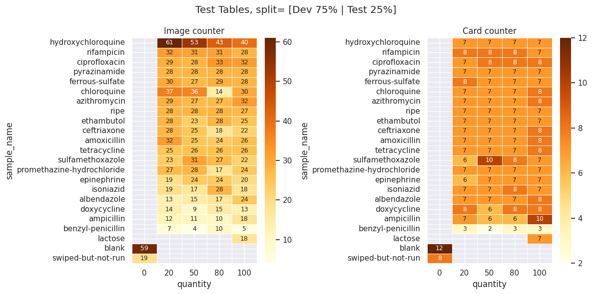
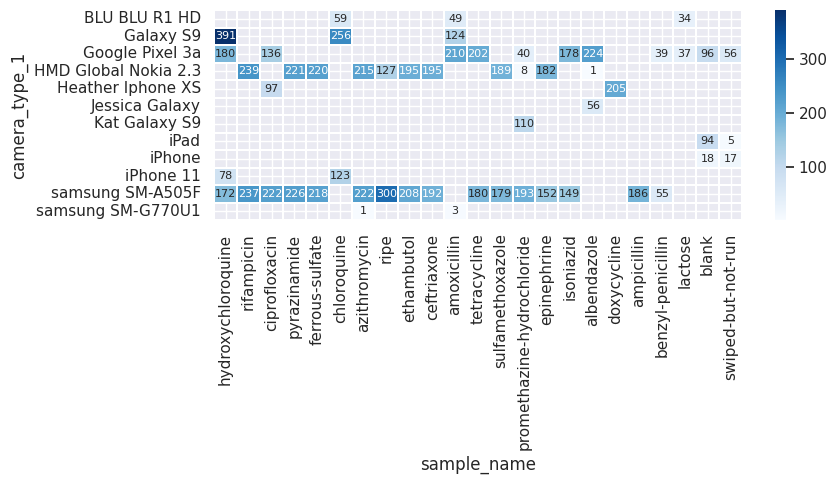

# <a id='toc1_'></a>[`FHI2020 Stratified Sampling` Dataset](#toc0_)


Welcome to the **FHI2020 Stratified Sampling Dataset**, a comprehensive collection of Paper Analytical Devices (PADs) used in the FHI2020 and FHI2022 projects. This dataset was utilized to train some machine learning models, as listed below:


| Model Name                    | Endpoint URL                                              | Dataset Name                  | Training Dataset                                                                                                                             | Test Dataset                                                                                                                                |
|-------------------------------|-----------------------------------------------------------|------------------------------|---------------------------------------------------------------------------------------------------------------------------------------------|---------------------------------------------------------------------------------------------------------------------------------------------|
| 24fhiNN1classifyAPI           | https://pad.crc.nd.edu/api/v2/neural-networks/16           | FHI2020_Stratified_Sampling   | [metadata_dev.csv](https://github.com/PaperAnalyticalDeviceND/pad_dataset_registry/blob/main/datasets/FHI2020_Stratified_Sampling/metadata_dev.csv) | [metadata_test.csv](https://github.com/PaperAnalyticalDeviceND/pad_dataset_registry/blob/main/datasets/FHI2020_Stratified_Sampling/metadata_test.csv) |
| 24 fhi NN1 API concentration   | https://pad.crc.nd.edu/api/v2/neural-networks/19           | FHI2020_Stratified_Sampling   | [metadata_dev.csv](https://github.com/PaperAnalyticalDeviceND/pad_dataset_registry/blob/main/datasets/FHI2020_Stratified_Sampling/metadata_dev.csv) | [metadata_test.csv](https://github.com/PaperAnalyticalDeviceND/pad_dataset_registry/blob/main/datasets/FHI2020_Stratified_Sampling/metadata_test.csv) |
| 24fhiNN1concAPI               | https://pad.crc.nd.edu/api/v2/neural-networks/17           | FHI2020_Stratified_Sampling   | [metadata_dev.csv](https://github.com/PaperAnalyticalDeviceND/pad_dataset_registry/blob/main/datasets/FHI2020_Stratified_Sampling/metadata_dev.csv) | [metadata_test.csv](https://github.com/PaperAnalyticalDeviceND/pad_dataset_registry/blob/main/datasets/FHI2020_Stratified_Sampling/metadata_test.csv) |
| 24fhiPLS1conc                 | https://pad.crc.nd.edu/api/v2/neural-networks/18           | FHI2020_Stratified_Sampling   | [metadata_dev.csv](https://github.com/PaperAnalyticalDeviceND/pad_dataset_registry/blob/main/datasets/FHI2020_Stratified_Sampling/metadata_dev.csv) | [metadata_test.csv](https://github.com/PaperAnalyticalDeviceND/pad_dataset_registry/blob/main/datasets/FHI2020_Stratified_Sampling/metadata_test.csv) |


---


**Table of contents**<a id='toc0_'></a>    
- [`FHI2020 Stratified Sampling` Dataset](#fhi2020-stratified-sampling-dataset)
  - [Description](#description)
    - [Data Distribution](#data-distribution)
      - [**All Dataset (8001 images)**](#all-dataset-8001-images)
      - [**Development set (5,923 images)**](#development-set-5923-images)
      - [**Test set (2078 images)**](#test-set-2078-images)
      - [**Camera and Drug Heatmap**](#camera-and-drug-heatmap)
    - [Directory Structure](#directory-structure)

<!-- vscode-jupyter-toc-config
	numbering=false
	anchor=true
	flat=false
	minLevel=1
	maxLevel=6
	/vscode-jupyter-toc-config -->
<!-- THIS CELL WILL BE REPLACED ON TOC UPDATE. DO NOT WRITE YOUR TEXT IN THIS CELL -->

---

## <a id='toc1_1_'></a>[Description](#toc0_)

This dataset draws from two projects, **FHI2020** and **FHI2022**. From Project FHI2020, it includes images of Paper Analytical Devices (PADs) that represent specific Active Pharmaceutical Ingredients (APIs) from a list of 20 APIs, available in one of four concentrations (*20%, 50%, 80%, 100%*), and PADs for `lactose` at *100%* concentration. From Project FHI2022, the dataset includes PADs categorized as `swiped but not run` and `blank`, with a nominal quantity of `0%` assigned for uniformity.

The collection features multiple images of each PAD, taken under various lighting conditions and with different devices. Each image has a unique `id`, and all images from the same PAD (same card) share a `sample_id`.

To address the challenge posed by its unbalanced nature regarding API names and quantities, a stratified sampling approach was employed for splitting the data into development (dev) and test sets.

Specifically, the dataset is divided considering PADs for each API along with each quantity category, ensuring a proportional representation across both developing and testing subsets under the splitting proportion of 25% and 75%, respectively.
 
This method maintains the balance of API types and quantities. It ensures that all photographs of the same PAD are kept together in the development or test set to prevent data leakage and promote model generalizability.


### <a id='toc1_1_1_'></a>[Data Distribution](#toc0_)

#### **All Dataset (8001 images)**


#### **Development set (5,923 images)**


#### **Test set (2078 images)**


#### **Camera and Drug Heatmap**


### <a id='toc1_1_2_'></a>[Directory Structure](#toc0_)

The dataset is organized within the `datasets/FHI2020_Stratified_Sampling` directory. Below is an overview of its structure and contents:

- **Development Set**: The images for the development set are stored in the `dev_images` directory, which contains 5,923 images.
- **Test Set**: The images for the test set are located in the `test_images` directory, with a total of 2,078 images.

- **Metadata**: Metadata files are provided for both the development and test sets:
  - `metadata_dev.csv` contains metadata for the development set.
  - `metadata_test.csv` contains metadata for the test set.
  - `labels.csv` contains a list of categories/classes in the dataset.

Here is the visual representation of the directory structure:

```markdown
datasets/FHI2020_Stratified_Sampling
├── labels.csv
├── metadata_dev.csv
├── metadata_test.csv
├── dev_images [5923 images]
└── test_images [2078 images]
```