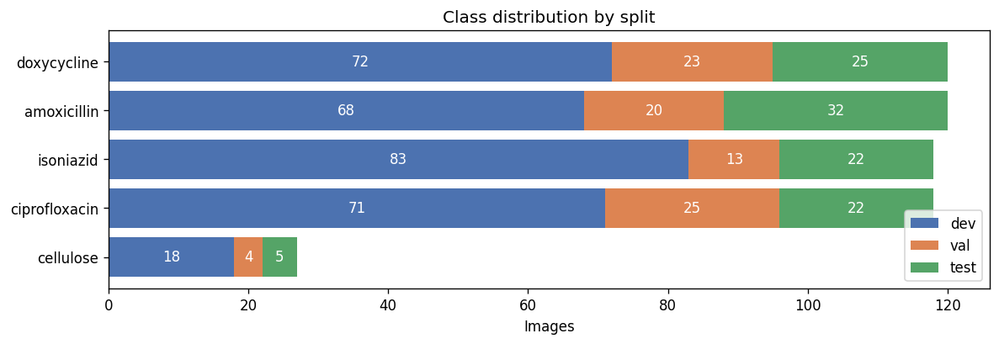
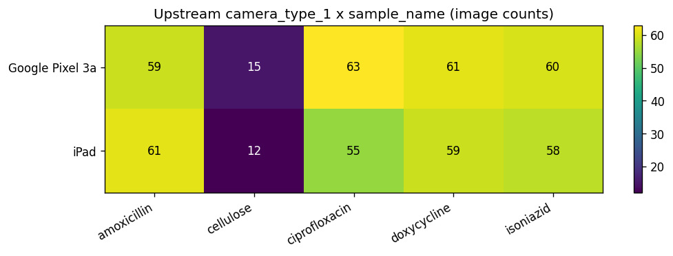

# `FHI360_Subset_PADFusion` Dataset

A 503-image subset of the FHI360 2020-2022 PAD card corpus, frozen with a fixed 60/25/15 training / test / categorize split, used as the CNN training data for the [`PaperAnalyticalDeviceND/model_fusion`](https://github.com/PaperAnalyticalDeviceND/model_fusion) PAD + NIR multimodal fusion project. The "categorize" split is the held-out evaluation set that the fusion pipeline consumes after CNN training.

## Description

503 card images from 85 unique sample IDs covering four antibiotic APIs (Amoxicillin, Ciprofloxacin, Doxycycline, Isoniazid) at five concentration buckets (0%, 20%, 50%, 80%, 100%), plus a Cellulose zero-API control. The five-bucket discretization is the one the trained CNN softmax outputs over; the published metadata carries the raw upstream `quantity` column from the source manifest.

### Data Distribution

| Split | Images | Unique sample IDs |
|---|---:|---:|
| Development (train) | 312 | 85 |
| Test | 106 | 66 |
| Validation (categorize) | 85 | 53 |
| **Total** | **503** | **85 (union)** |

The `val` split is the original "categorize" set: a held-out partition consumed by the fusion pipeline for downstream evaluation and as input to the NIR / PLS-R late-fusion stage. It is not a validation set in the hyperparameter-tuning sense.

#### Class Distribution

|    | class       | #dev | #val | #test | #total |
|:---|:------------|-----:|-----:|------:|-------:|
| 0  | amoxicillin |   68 |   20 |    32 |    120 |
| 1  | cellulose   |   18 |    4 |     5 |     27 |
| 2  | ciprofloxacin |   71 |   25 |    22 |    118 |
| 3  | doxycycline |   72 |   23 |    25 |    120 |
| 4  | isoniazid   |   83 |   13 |    22 |    118 |
| -  | #total      |  312 |   85 |   106 |    503 |

The class names `ciprofloxacin` and `isoniazid` are preserved from the upstream FHI360 source CSVs and are typographic variants of "ciprofloxacin" and "isoniazid"; they refer to the same physical drugs.

#### Dataset Visualizations

**Class Distribution by Split**


**Upstream Camera × Drug**


Camera coverage is balanced between `Google Pixel 3a` and `iPad` for the four antibiotic APIs (55-63 images per camera × drug cell). Cellulose is under-sampled relative to the APIs (12-15 per cell) by design: it is the zero-API control, not a class with equal training share.

### What's in the metadata

Each row carries the standard 8-column registry schema:

| Column | Description |
|---|---|
| `id` | Upstream PAD image ID on `pad.crc.nd.edu` |
| `sample_id` | Physical card ID (PAD#) |
| `sample_name` | Lowercase drug class (`amoxicillin`, `cellulose`, `ciprofloxacin`, `doxycycline`, `isoniazid`) |
| `quantity` | API concentration as integer percent (0, 20, 50, 80, 100) |
| `camera_type_1` | Raw upstream camera string (`Google Pixel 3a`, `iPad`) |
| `url` | Full HTTPS URL to the PNG on the PAD server |
| `hashlib_md5` | Lowercase hex md5 of the PNG file bytes |
| `image_name` | `<id>__<sample_id>__<sample_name>__<quantity>.png` |

No extended columns in this release.

### What this dataset is used for

This is the CNN training corpus for the multimodal fusion project at [`PaperAnalyticalDeviceND/model_fusion`](https://github.com/PaperAnalyticalDeviceND/model_fusion). A ResNet50 backbone with an energy-regularized loss is trained on the `dev` split, evaluated on `test`, and produces embeddings on the `val` (categorize) split that are then fused with paired NIR spectroscopy via per-drug PLS-R or SVM-based late fusion. Wiki pages for the consuming experiments:

- [Experiment 1: PAD CNN](https://github.com/PaperAnalyticalDeviceND/model_fusion/wiki/Experiment-1-PAD-CNN)
- [Experiment 7: Realistic field fusion](https://github.com/PaperAnalyticalDeviceND/model_fusion/wiki/Experiment-7-Realistic-Fusion)
- [Experiment 18: CNN + PLS-R late fusion](https://github.com/PaperAnalyticalDeviceND/model_fusion/wiki/Experiment-18-CNN-PLSR-Fusion)

### Source manifest

The published metadata is the inner join of two artifacts in the source repository:

| Artifact | Path | md5 |
|---|---|---|
| PAD card metadata | `Data/PAD/fusion_model_data.csv` | `dcdf0e853368b6ffd1f48dc2446c1cce` |
| Split assignment HDF5 | `neural_network/fhi360_data_quantity/pad_dataset_quantity.h5` | `c034b42a86cc8265bff84bad7e82cce3` |

The split is reproducible: rerun `scripts/build_registry_release.py` against the same two inputs and the row-to-split mapping is byte-identical.

### Directory Structure

```markdown
datasets/FHI360_Subset_PADFusion_v2.0/
├── README.md
├── class_distribution.csv
├── croissant.jsonld
├── dataset_sizes.md
├── figs/
│   ├── class_distribution.png
│   └── camera_drug_heatmap.png
├── labels.csv
├── metadata_dev.csv
├── metadata_test.csv
├── metadata_val.csv
└── projects.csv
```

### Citation

If you use this dataset, please cite:

> Mike, M., Sweet, C. *FHI360 PAD-NIR Fusion Subset, v2.0.* Lieberman Lab, University of Notre Dame. <https://github.com/PaperAnalyticalDeviceND/model_fusion>

### License

Apache License 2.0 (consistent with the parent registry).
