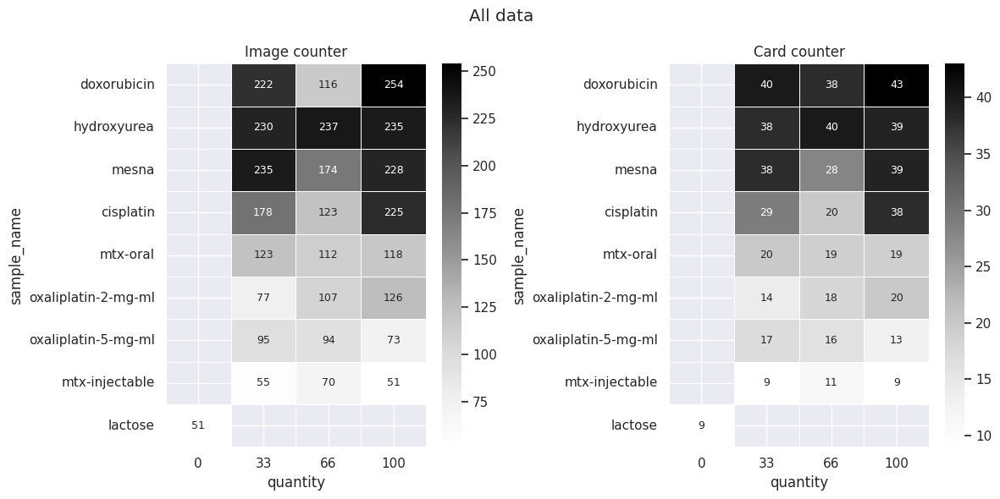
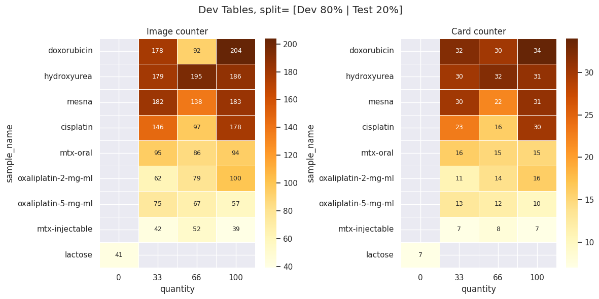
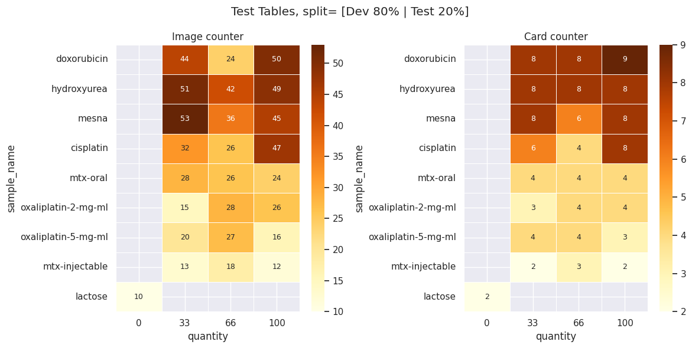
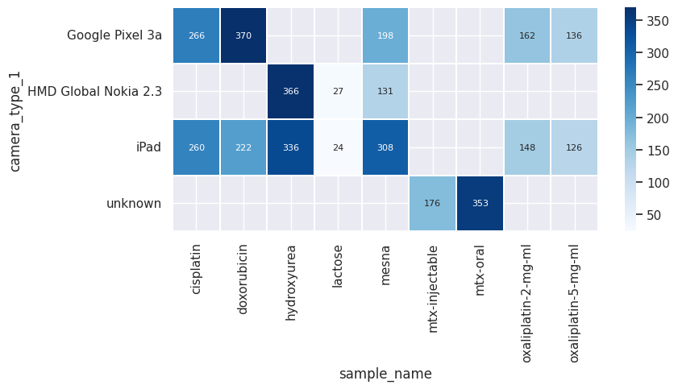

# `ChemoPADNNtraining2024` Dataset

The ChemoPADNNtraining2024 Dataset is a curated collection of Paper Analytical Device (PAD) images used for chemotherapy drug identification and analysis.

## Description

This dataset consists of 3,609 images from 624 unique samples, divided into development and test sets. The dataset is designed for training machine learning models to identify and analyze various chemotherapy drugs and related substances using PAD technology. The Active Pharmaceutical Ingredients (APIs) are available in one of four concentrations (*0%, 33%, 66%, 100%*), providing a comprehensive range for concentration-dependent analysis.

### Data Distribution

The dataset is split into:
- **Development/Validation Set**: 2,847 images (492 unique samples)
- **Test Set**: 762 images (132 unique samples)

#### Class Distribution

|    | class                 |   #dev |   #test |   #total |
|:---|:---------------------|-------:|--------:|---------:|
| 0  | hydroxyurea          |    561 |     141 |      702 |
| 1  | mesna                |    509 |     128 |      637 |
| 2  | doxorubicin          |    474 |     118 |      592 |
| 3  | cisplatin            |    421 |     105 |      526 |
| 4  | mtx-oral             |    282 |      71 |      353 |
| 5  | oxaliplatin-2-mg-ml  |    248 |      62 |      310 |
| 6  | oxaliplatin-5-mg-ml  |    210 |      52 |      262 |
| 7  | mtx-injectable       |    141 |      35 |      176 |
| 8  | lactose              |     41 |      10 |       51 |
| -  | #total               |   2891 |     723 |     3614 |

#### Dataset Visualizations



**Development Set Distribution**


**Test Set Distribution**


**Camera and Drug Distribution**


### Directory Structure

The dataset is organized within the `datasets/Leiberman-Lab_ChemoPADNNtraining2024_Partial-Drug-Set_v1.0` directory. Below is an overview of its structure and contents:

```markdown
datasets/Leiberman-Lab_ChemoPADNNtraining2024_Partial-Drug-Set_v1.0/
├── metadata_dev.csv
├── metadata_test.csv
├── labels.csv
├── projects.csv
├── class_distribution.csv
├── dataset_sizes.md
├── croissant.jsonld
└── figs/
    ├── camera_drug_heatmap.png
    ├── dev__tsize_20.png
    ├── test__tsize_20.png
    └── all_data.png
```


<!-- 
## License
## Contact
## How to cite
## Acknowledgements
## Contributors
## Versioning
--> 