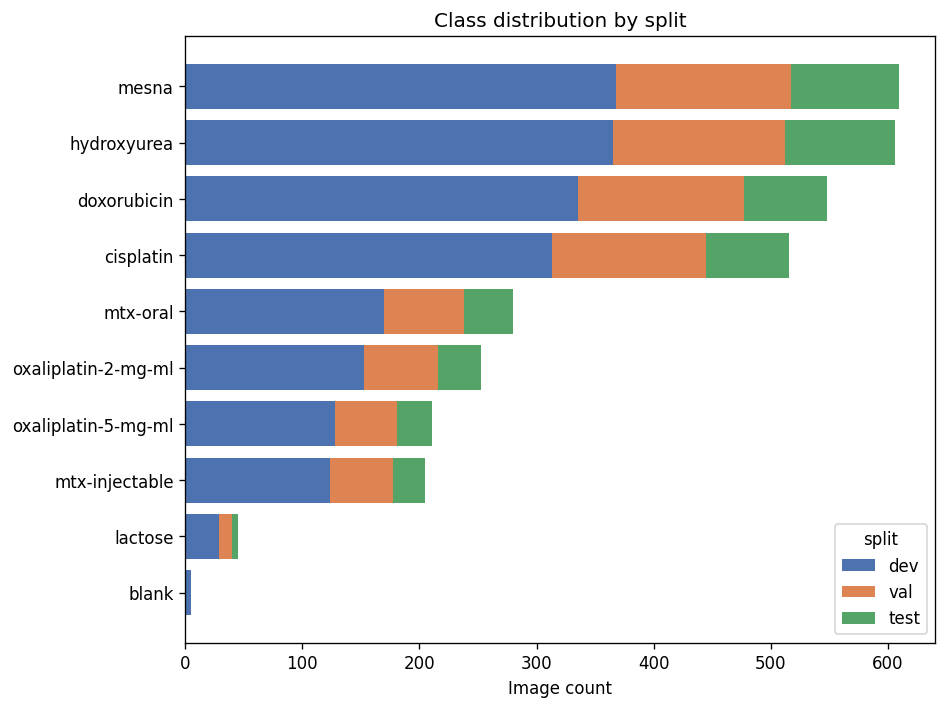
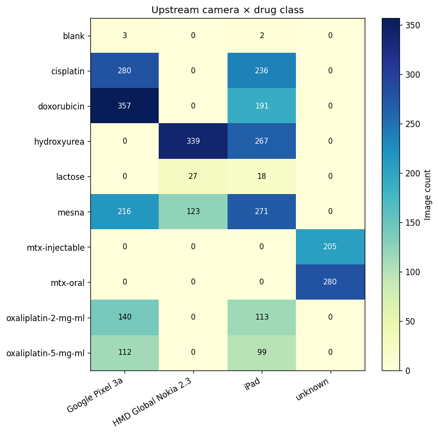
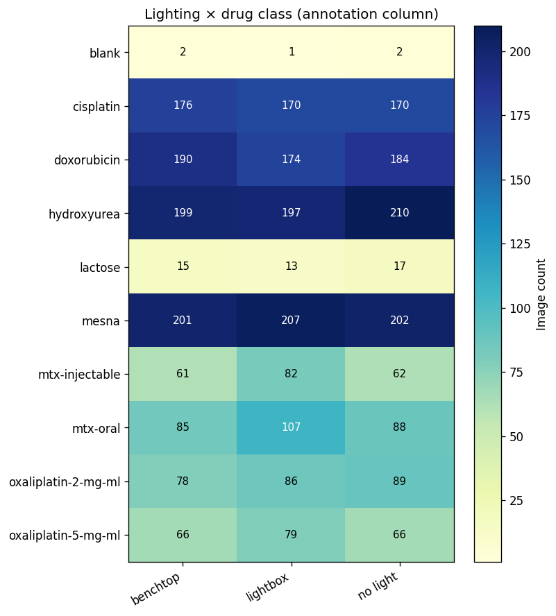
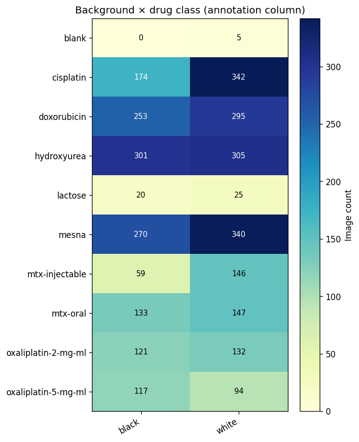

# `ChemoPADPLStraining2026_Annotated` Dataset

The annotated successor to the `Leiberman-Lab_ChemoPADNNtraining2024_Partial-Drug-Set_v1.0` release. The project label is updated to `ChemoPADPLStraining2026` because (a) the predominant downstream method on this corpus has been per-drug PLS concentration regression and PLS-DA classification, with neural-network experiments filed as comparison points rather than the primary modelling line, and (b) the annotation pass and HPLC re-labelling completed in 2026. This version is a hand-curated extension of the original ChemoPAD corpus and ships HPLC-measured concentration labels alongside annotation-specific quality flags (Lighting, Background, upstream `status`, `missing_card`).

## Description

This dataset consists of 3279 card images from 646 unique samples (PAD#s), split deterministically by PAD# into development, validation, and test sets so that no card is shared between splits. The Active Pharmaceutical Ingredients (APIs) cover eight chemotherapy drugs plus Lactose and Blank, at continuous concentrations measured by HPLC (not the nominal 33 / 66 / 100 % buckets of the prior release).

### Data Distribution

| Split | Images | Unique PAD#s |
|---|---:|---:|
| Development (train) | 1990 | 395 |
| Validation | 818 | 158 |
| Test | 471 | 93 |
| **Total** | **3279** | **646** |

#### Class Distribution

|    | class               |   #dev |   #val |   #test |   #total |
|:---|:--------------------|-------:|-------:|--------:|---------:|
| 0  | mesna               |    368 |    149 |      93 |      610 |
| 1  | hydroxyurea         |    365 |    147 |      94 |      606 |
| 2  | doxorubicin         |    335 |    142 |      71 |      548 |
| 3  | cisplatin           |    313 |    132 |      71 |      516 |
| 4  | mtx-oral            |    170 |     68 |      42 |      280 |
| 5  | oxaliplatin-2-mg-ml |    153 |     63 |      37 |      253 |
| 6  | oxaliplatin-5-mg-ml |    128 |     53 |      30 |      211 |
| 7  | mtx-injectable      |    124 |     53 |      28 |      205 |
| 8  | lactose             |     29 |     11 |       5 |       45 |
| 9  | blank               |      5 |      0 |       0 |        5 |
| -  | #total              |   1990 |    818 |     471 |     3279 |

#### Dataset Visualizations

**Class Distribution by Split**


**Upstream Camera × Drug**


Coverage gap visible: `HMD Global Nokia 2.3` only carries Hydroxyurea (and a small Mesna slice), so any per-Nokia analysis is constrained to those two drugs. `unknown` is the bucket for the Methotrexate variants. iPad and Pixel 3a cover the rest.

**Lighting × Drug** (annotation column)


Lighting (`lightbox`, `benchtop`, `no light`) is balanced for the four largest drug classes; lower-count drugs still have all three lightings represented.

**Background × Drug** (annotation column)


Background (`black`, `white`) is imbalanced for several drugs: Cisplatin and Mesna lean white; Oxaliplatin 5 mg/mL leans slightly black. Useful for stratified evaluations.

### What's annotated

Each row carries the standard registry columns (`id, sample_id, sample_name, quantity, camera_type_1, url, hashlib_md5, image_name`) plus five extended columns that are the value proposition of this release:

| Column | Values | Source |
|---|---|---|
| `camera_bucket` | `ipad`, `pixel`, `nokia` | analyst-merged 3-bucket relabel of the upstream `camera_type_1` |
| `lighting` | `lightbox`, `benchtop`, `no light` | annotator-recorded capture lighting |
| `background` | `black`, `white` | annotator-recorded background colour |
| `status` | `valid`, `invalid` | joined from upstream `unmatched_cards_export.csv` |
| `missing_card` | `True`, `False` | annotator flag for cards the analyst could not visually review |

Strict-schema consumers ignore unknown columns; tools that know them can use them as capture-condition covariates or quality filters.

### What changed vs the prior `Partial-Drug-Set_v1.0` release

- **+1,206 unique cards added** (3,714 vs 2,847) and **+154 unique PAD#s** (646 vs 492) through the annotation effort.
- **HPLC-measured concentrations**. The `quantity` column carries HPLC ground-truth concentrations (rescaled per API to % of nominal strength). See the per-API scale-factor audit at `data/HPLC/per_api_scale_factors.csv` in the source repo for the derivation.
- **PAD#-grouped split discipline.** The deterministic 60 / 25 / 15 train / val / test split groups by physical card (PAD#); no card leaks across splits.
- **Camera bucketing.** Upstream camera strings are merged into three buckets (`ipad`, `pixel`, `nokia`) by the analyst; the raw upstream string is preserved in `camera_type_1`.
- **Explicit quality flags** (`status`, `missing_card`) and capture-condition covariates (`lighting`, `background`) for stratified evaluations.

### Source manifest

`data/splits/manifest.csv` (md5 `6da9b45dae27fd75e278adbaa608e808`) is the authoritative input. The deterministic split is reproducible.

### Directory Structure

```markdown
datasets/Leiberman-Lab_ChemoPADPLStraining2026_Annotated_v1.0/
├── README.md
├── class_distribution.csv
├── croissant.jsonld
├── dataset_sizes.md
├── figs/
│   ├── class_distribution.png
│   ├── camera_drug_heatmap.png
│   ├── lighting_drug_heatmap.png
│   └── background_drug_heatmap.png
├── labels.csv
├── metadata_dev.csv
├── metadata_test.csv
├── metadata_val.csv
└── projects.csv
```

### Citation

If you use this dataset, please cite:

> Wilfinger, M., Mike, M., Sweet, C. *Annotated ChemoPAD NN Training Dataset, v1.0.* Lieberman Lab, University of Notre Dame. <https://github.com/PaperAnalyticalDeviceND/annotated_chemopad>

### License

Apache License 2.0 (consistent with the parent registry).
