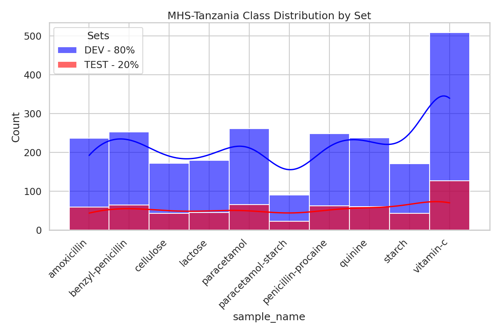

# `MHS-Tanzania` Dataset


The MHS-Tanzania Dataset is a curated collection of cards employed in the MHS-Tanzania project.

## Description

The dataset is composed of 2949 images of cards from the MHS-Tanzania dataset. The dataset is divided into two subsets: the development set and the test set. The development set contains 2359 images, while the test set contains 590 images. The dataset also contains metadata for each image, which includes the card's class, the card's ID, and the image's path. The dataset's class distribution is also available in the `class_distribution.csv` file. 


### Directory Structure

The dataset is organized within the `datasets/MHS-Tanzania` directory. Below is an overview of its structure and contents:

- **Development Set**: The images for the development set are stored in the `dev_images` directory, which contains 2,359 images.
- **Test Set**: The images for the test set are located in the `test_images` directory, with a total of 590 images.

- **Metadata**: Metadata files are provided for both the development and test sets:
  - `metadata_dev.csv` contains metadata for the development set.
  - `metadata_test.csv` contains metadata for the test set.

- **Class Distribution**: The `class_distribution.csv` file details the distribution of classes across the datasets.


Here is the visual representation of the directory structure:

```markdown
datasets/MHS-Tanzania
├── class_distribution.csv
├── metadata_dev.csv
├── metadata_test.csv
├── dev_images [2359 images]
└── test_images [590 images]
```

### Data Distribution 

|    | class               |   #dev |   #test |   #total |
|:---|:--------------------|-------:|--------:|---------:|
| 0  | vitamin-c           |    509 |     127 |      636 |
| 1  | paracetamol         |    261 |      65 |      326 |
| 2  | benzyl-penicillin   |    253 |      64 |      317 |
| 3  | penicillin-procaine |    248 |      62 |      310 |
| 4  | quinine             |    238 |      60 |      298 |
| 5  | amoxicillin         |    237 |      59 |      296 |
| 6  | lactose             |    180 |      45 |      225 |
| 7  | cellulose           |    172 |      43 |      215 |
| 8  | starch              |    171 |      43 |      214 |
| 9  | paracetamol-starch  |     90 |      22 |      112 |
| -  | #total              |   2359 |     590 |     2949 |



## How to download the dataset 

### Using DVC 

```bash
dvc get https://github.com/PaperAnalyticalDeviceND/pad_dataset_registry datasets/MHS-Tanzania
```

<!-- 
## License
## Contact
## How to cite
## Acknowledgements
## Contributors
## Versioning
 -->


