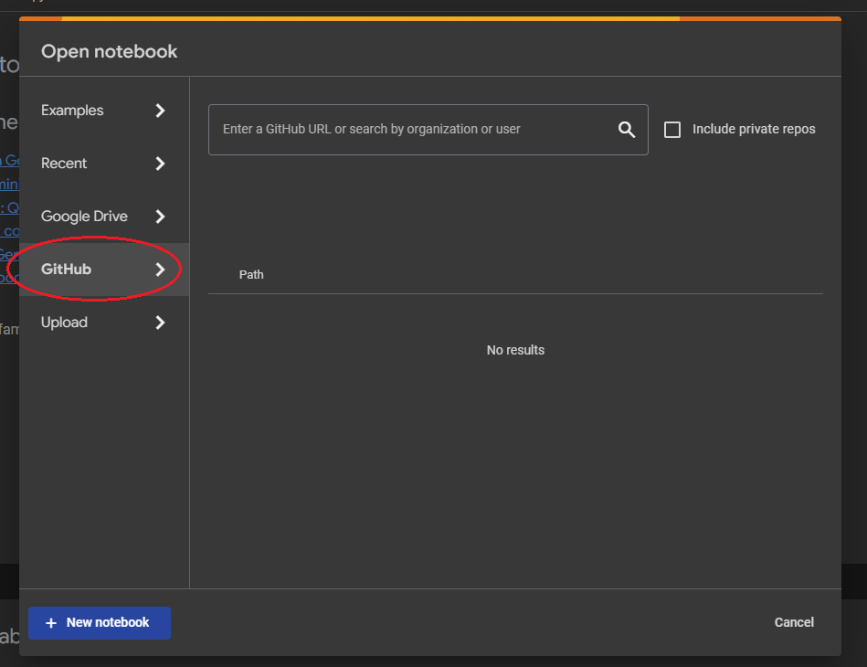
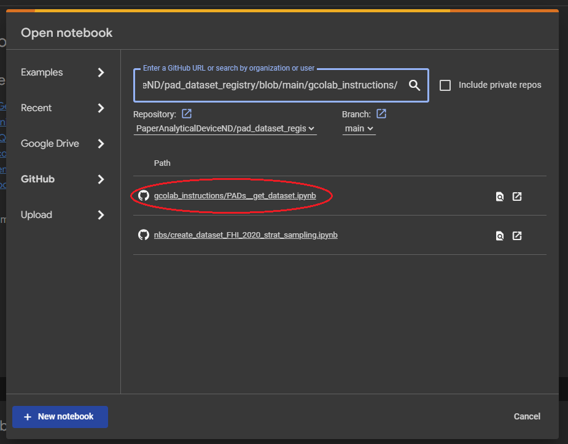

# Opening a Specific Jupyter Notebook on Google Colab

This guide provides step-by-step instructions on how to open the `PADs_get_dataset.ipynb` notebook from the GitHub repository `psaboia/pad-ml-pipeline` on Google Colab.

## Step 1: Visit Google Colab
Go to the [Google Colab website](figs/https://colab.research.google.com/) and start the process by clicking on the `Open Colab` button.

## Step 2: Open the 'Open notebook' Interface and Navigate to GitHub Tab
Within Colab, go to the `File` menu and choose `Open notebook` to bring up the notebook navigation dialog.\
In the 'Open notebook' dialog, select the `GitHub` tab, which allows you to open notebooks directly from GitHub repositories.

## Step 3: Open the Notebook from the Repository
In the GitHub tab, paste the following URL into the search bar:
`https://github.com/PaperAnalyticalDeviceND/pad_dataset_registry/blob/main/gcolab_instructions/`

This will automatically locate the `PADs_get_dataset.ipynb` notebook. Click on the notebook to open it in Colab.

## Step 4: Interact with the Notebook
The notebook will now be loaded into your Google Colab environment, where you can run code cells, add new cells, and fully interact with the content.

Remember, any changes you make in the Colab environment are not automatically saved back to GitHub. If you want to preserve your changes, you'll need to save a copy of the notebook to Google Drive or download it to your local machine.
